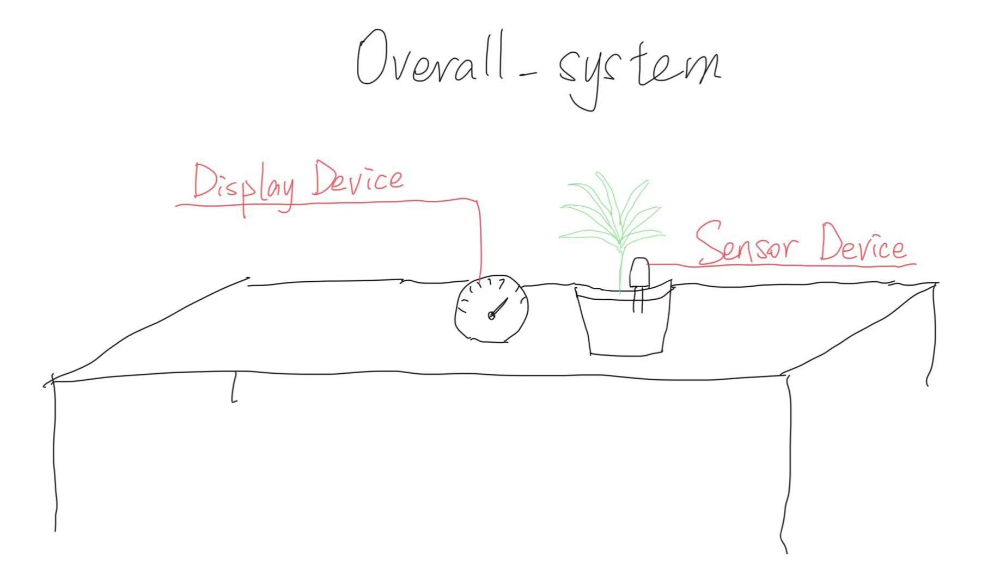
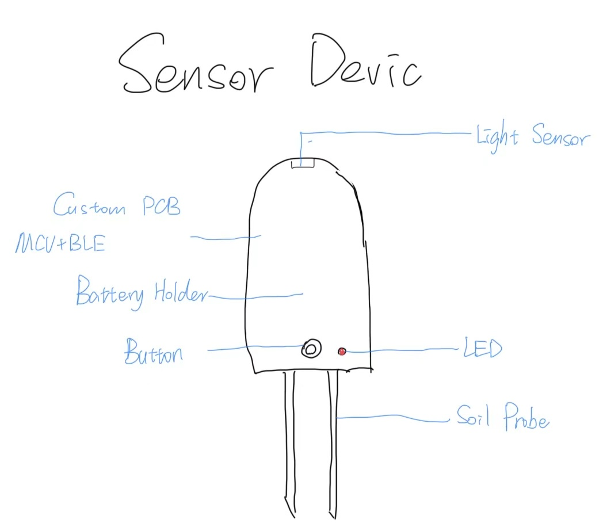
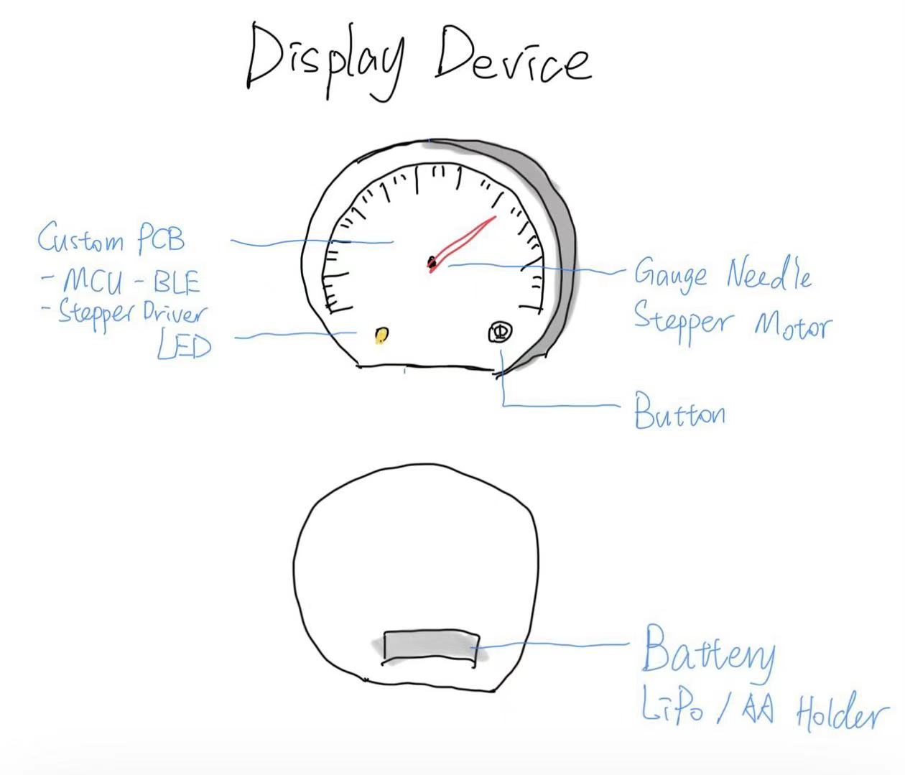
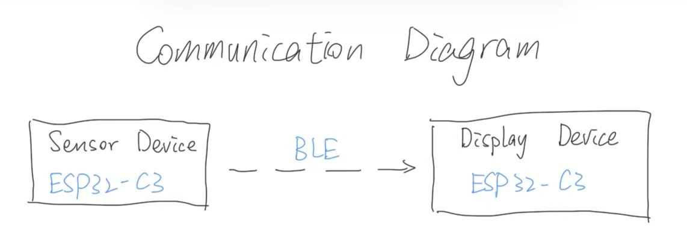
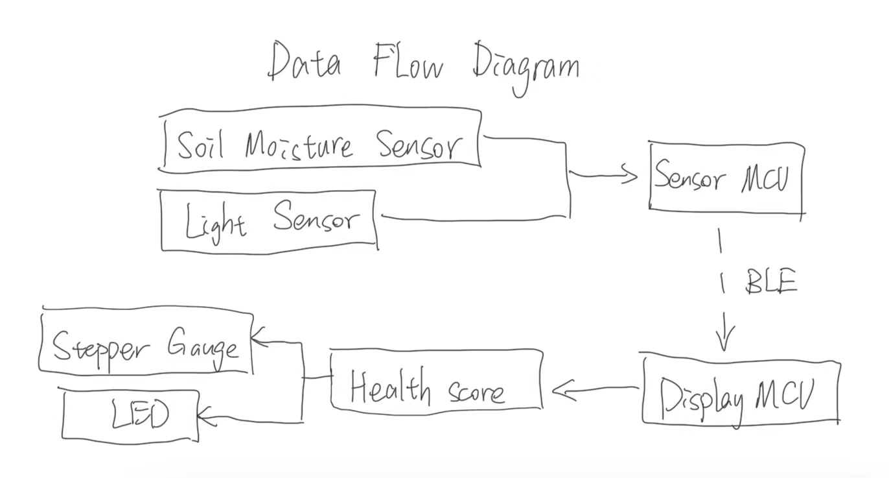

# Plant Health Gauge

## Project Overview

The Plant Health Gauge is a two-device system designed to monitor plant conditions and present overall plant health in an intuitive, physical format. The system consists of a plant-mounted sensor device and a separate tabletop display device that communicate wirelessly via Bluetooth Low Energy (BLE).

The sensor device is placed directly in the plant pot to monitor soil and light conditions, while the display device presents a summarized plant health score using a stepper-motor-driven gauge needle, LEDs, and a button. This separation allows sensing and display to be optimized for their respective physical contexts.

## Sensor Device

The sensor device is a compact, battery-powered unit designed to be inserted into the soil of a plant pot. It is responsible for collecting environmental data and transmitting it wirelessly to the display device.

### Physical Components (as shown in sketch)
- Soil probe extending into the soil
- Enclosed housing containing electronics and battery
- Front-facing status LED and user button
- Top-facing ambient light sensor

### Functionality
- Measures soil moisture through a soil probe
- Measures ambient light level using a light sensor
- Periodically transmits sensor readings via Bluetooth Low Energy (BLE)
- Designed for low power operation to support long-term use

### Key Electronics and Parts
- **Microcontroller with BLE:** ESP32-C3  
- **Soil Moisture Sensor:** Capacitive Soil Moisture Sensor v1.2 (soil probe)  
- **Light Sensor:** BH1750 Digital Light Sensor (mounted at top of enclosure)  
- **User Interface:**  
  - Status LED (front-facing)  
  - Push button (front-facing)  
- **Power:** Battery holder for coin cell or AA battery  
- **Electronics:** Custom-designed PCB integrating MCU, sensors, LED, button, and power circuitry

## Display Device

The display device is a standalone tabletop unit that receives data from the sensor device and provides a physical visualization of plant health.

### Physical Components (as shown in sketch)
- Circular gauge with a mechanical needle
- Internal stepper motor driving the gauge needle
- Front-facing LED indicator
- User button
- Internal battery compartment

### Functionality
- Receives soil moisture and light data wirelessly via BLE
- Computes an overall plant health score on the display MCU
- Maps the health score to the angular position of the gauge needle
- Uses LEDs for status indication and a button for user interaction

### Key Electronics and Parts
- **Microcontroller with BLE:** ESP32-C3  
- **Stepper Motor:** 28BYJ-48 stepper motor (drives gauge needle)  
- **Stepper Motor Driver:** Integrated on custom PCB  
- **User Interface:**  
  - Gauge needle  
  - Status LED  
  - Push button  
- **Power:** Rechargeable LiPo battery or AA battery holder for tabletop use  
- **Electronics:** Custom-designed PCB integrating MCU, stepper driver, LED, button, and power regulation

A mechanical gauge is intentionally used instead of a screen to provide a glanceable, low-distraction indication of plant health.

## System Communication Diagram

The sensor device and display device communicate wirelessly using Bluetooth Low Energy (BLE). Both devices are built around ESP32-C3 microcontrollers.

- The sensor device acts as a BLE peripheral
- The display device acts as a BLE central receiver

## Data Flow Diagram

The system processes data in the following sequence:

1. Soil moisture sensor and light sensor collect raw environmental data  
2. Sensor MCU (ESP32-C3) reads and packages sensor data  
3. Sensor MCU transmits data wirelessly via BLE  
4. Display MCU (ESP32-C3) receives sensor data  
5. Display MCU computes an overall plant health score  
6. Health score drives the stepper motor gauge needle and LED indicators  

## Implementation Notes

Both the sensor device and the display device will be implemented using custom-designed PCBs. Datasheets for all major components—including the ESP32-C3 microcontroller, soil moisture sensor, light sensor, stepper motor, and power components—are included in the `datasheets/` directory of this repository.
